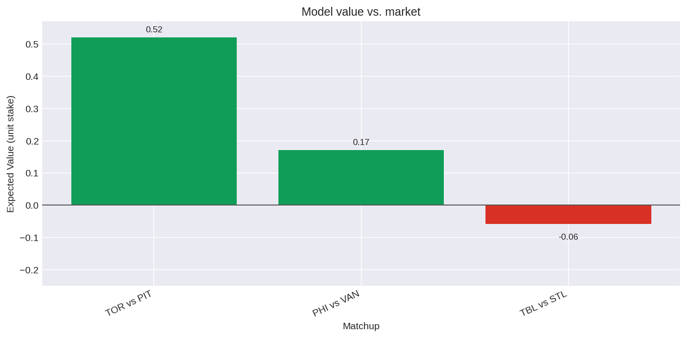
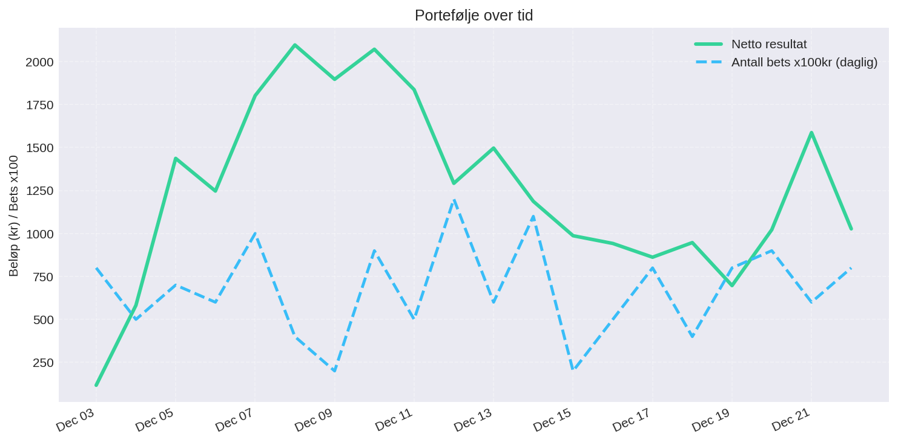
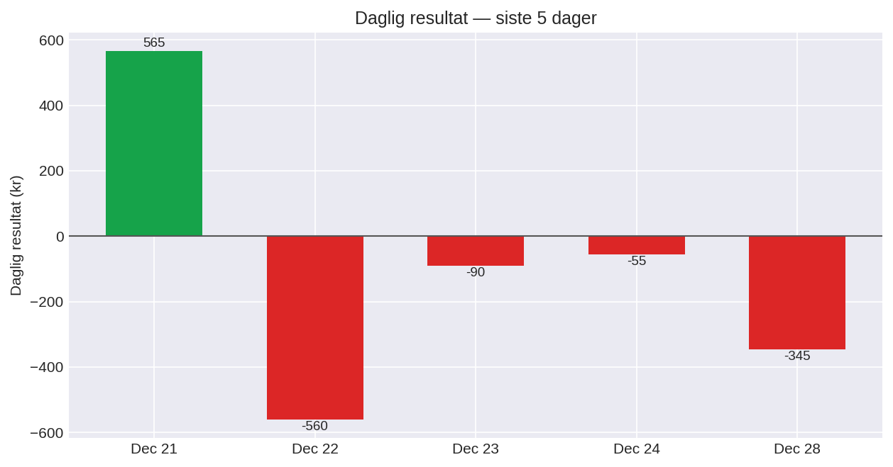

# NHL Prediction Model - Full Stack Setup

ML-modell for NHL-odds med FastAPI-backend og Next.js-frontend (value-board, portefølje og egendefinerte prediksjoner).

## 📊 Latest Value Bets
  
➡️ [View full markdown table](./TODAY.md)

## 📈 Portefølje over tid


## 📊 Daglig resultat (siste 5 dager)


## 🚀 Komme i gang

### 1. Backend (FastAPI)
- Krav: Python 3.11+ anbefales.
- ```bash
  cd NHL
  python -m venv .venv && source .venv/bin/activate  # valgfritt
  pip install -r requirements-api.txt
  python api.py
  ```
- Sørg for modellfil i `models/nhl_model.pkl`. Kjør `python train_model.py` hvis den mangler.
- Start API-serveren: `python api.py` (kjører på `http://localhost:8000`, docs på `/docs`).
- CORS: alle localhost-porter er tillatt, men sett `FRONTEND_ORIGINS` hvis frontend kjører på et annet domene/host.

### 2. Frontend (Next.js 16)
- Krav: Node 20+.
- ```bash
  cd nhl-frontend
  npm install
  # pek mot API-et om det ikke kjører lokalt:
  export NEXT_PUBLIC_API_BASE=http://localhost:8000
  npm run dev
  ```
- Frontend kjører på `http://localhost:3000`. For prod: `npm run build && npm start`.

## 📋 API Endpoints
- `GET /` – API info.
- `GET /teams` – Liste over lag med id/abbreviation.
- `POST /predict` – Prediksjon + siste 5 kamper og stats.
  ```json
  { "home_team": "BOS", "away_team": "MTL" }
  ```
- `GET /value-report?days=3` – Modellodds vs. Norsk Tipping-odds (0–10 dager frem). Alias: `/value_report`.
- `GET /portfolio` – Tidsserie + sammendrag + bet-liste fra `data/bet_history.csv`.
- `POST /portfolio/update` – Avregner ferdige kamper og legger til nye value-bets. Body-felter: `days_ahead`, `stake_per_bet`, `min_value`, `value_games` (prefetch fra frontend).

## 🎨 Frontend
- Value board for i dag + neste 7 dager med modellodds, markedodds og best value pr. utfall.
- Porteføljeseksjon med investert/verdi-graf, ROI og manuell oppdatering via `/portfolio/update`.
- Egendefinert matchup-panelet viser sannsynlighet (Home/OT/Away), siste 5 kamper og nøkkelstatistikk for valgte lag.
- API-base kan settes via `NEXT_PUBLIC_API_BASE` (default: `http://localhost:8000` i dev).

## 🧠 Backend
- FastAPI med CORS for frontend og caching av modell/lag-mapping.
- Live data: henter NHL-kamper og odds fra Norsk Tipping, samt kampdata fra NHL API.
- Bet-tracker som lagrer til `NHL/data/bet_history.csv` og beregner tidsserie + ROI til frontend.
- Random Forest-modell (`models/nhl_model.pkl`) med treningsscript (`train_model.py`).

## 🛠️ Teknologi
- **Backend:** Python 3.11+, FastAPI, Pandas, scikit-learn, Requests.
- **Frontend:** Next.js 16 (App Router, TypeScript), React 19, Tailwind CSS v4, lucide-react.

## 📁 Prosjektstruktur
```
Prediction Model/
├── NHL/
│   ├── api.py                  # FastAPI API
│   ├── bet_tracker.py          # Value-bets + portefølje
│   ├── predict.py              # CLI-prediksjon fra lag-id
│   ├── predict_live.py         # CLI-prediksjon med live data
│   ├── predict_with_odds.py    # CLI med odds/value
│   ├── train_model.py          # Trener Random Forest
│   ├── requirements-api.txt
│   ├── data/
│   │   ├── bet_history.csv
│   │   ├── game.csv
│   │   └── team_info.csv
│   ├── live/                   # Live odds + formbygging
│   │   ├── form_engine.py
│   │   ├── live_feature_builder.py
│   │   ├── nhl_api.py
│   │   └── nt_odds.py
│   ├── models/
│   │   └── nhl_model.pkl
│   └── utils/
│       ├── data_loader.py
│       ├── feature_engineering.py
│       └── model_utils.py
└── nhl-frontend/
    ├── app/page.tsx
    ├── components/             # Value board, portefølje, matchup
    ├── lib/format.ts
    ├── types/index.ts
    ├── package.json
    └── ...
```

## 🎯 Bruk
1. Start backend (`python api.py`) og frontend (`npm run dev`).
2. Åpne `http://localhost:3000`.
3. Se value boardet eller velg hjemmelag/bortelag og trykk "Prediker resultat".
4. Oppdater porteføljen fra UI (kun hvis API-et er tilgjengelig) for å hente siste bets.

## 🔁 Automatisk value-tracking
1. **Data lagres i** `NHL/data/bet_history.csv` (opprettes automatisk).
2. **Daglig oppdatering**:
   ```bash
   cd NHL
   python bet_tracker.py
   ```
   - Avregner ferdige kamper og oppdaterer profit.
   - Legger til beste value-bets per dag (standard stake 100 kr, min value 0.01).
3. **Graf / frontend**: `GET /portfolio` for data (realisert resultat + åpen innsats – stake teller ikke som påfyll). `POST /portfolio/update` kan kalles fra cron/API om du vil trigge via HTTP.
4. **Tilpasninger**: juster stake/value i `bet_tracker.update_daily_bets` eller i body til `/portfolio/update`:
   ```json
   { "days_ahead": 1, "stake_per_bet": 100, "min_value": 0.01 }
   ```
5. **GitHub Actions**: `.github/workflows/daily-bet-update.yml` kjører daglig, sørger for modell (trener ved behov) og committer ny `bet_history.csv`. Aktiver Actions og sjekk at default branch er korrekt.

## 🐛 Feilsøking
- Backend: `pip install -r NHL/requirements-api.txt`, sjekk at `models/nhl_model.pkl` finnes og at serveren kjører på port 8000.
- Frontend: sett `NEXT_PUBLIC_API_BASE` hvis API ikke er lokalt, og restart med `npm run dev` ved behov. Sjekk nettverkstrafikk i devtools hvis noe feiler.
