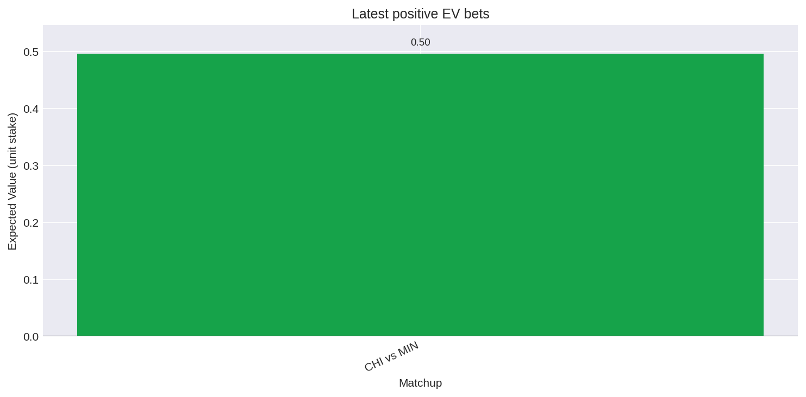
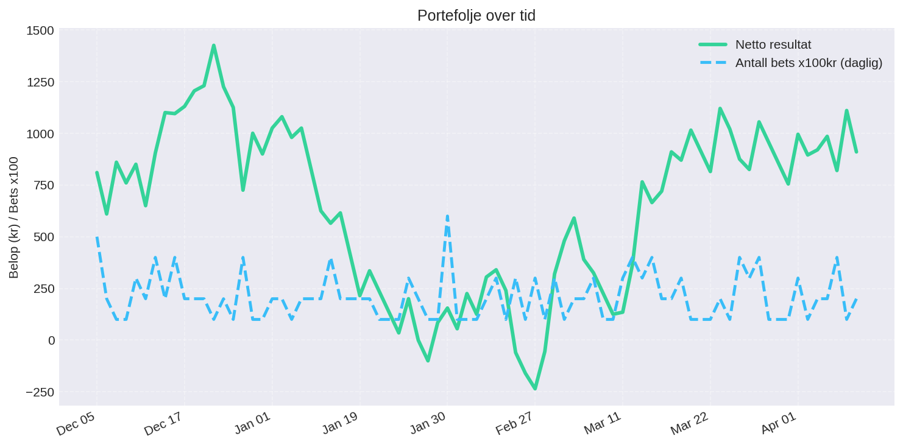
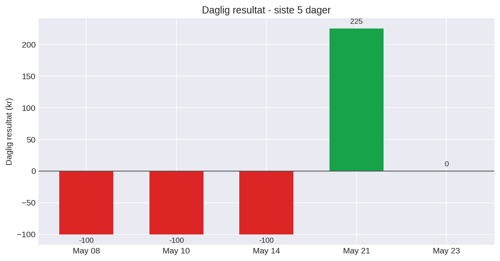
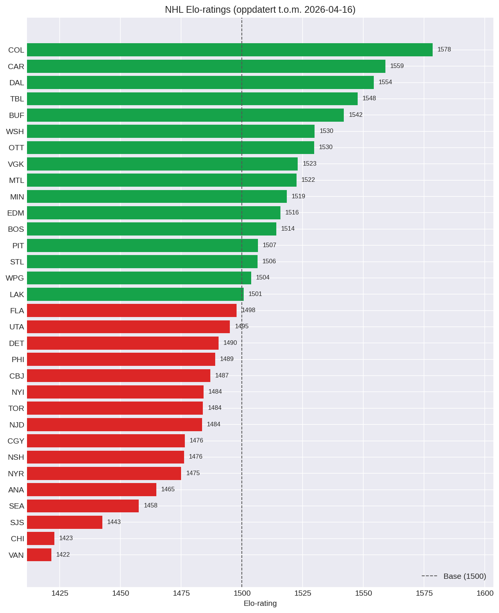

# NHL Prediction Model - Full Stack Setup

ML-modell for NHL-odds med FastAPI-backend og Next.js-frontend (value-board, portefølje og egendefinerte prediksjoner).

## 📊 Latest Value Bets
  
➡️ [View full markdown table](./docs/TODAY.md) (kun positive EV-bets)

## 📈 Portefølje over tid


<!-- STATUS:START -->
### Sesong 2025-26

| Logg | Spill | Resultat | ROI |
| --- | ---: | ---: | ---: |
| Portefølje | 182 | +560 kr | +3.1 % |
| Skygge (under EV-terskel / odds for høye) | – | – | – |

Treffrate 34.6 % · 0 åpne spill · totalt siden start +560 kr på 182 spill.
<!-- STATUS:END -->

## 📊 Daglig resultat (siste 5 dager)


## ♟️ Elo-ratings (nåværende)

➡️ Lagres i `NHL/models/elo_ratings.json` og oppdateres daglig fra faktiske resultater via NHL-APIet (`update_elo_ratings.py`).

## 🚀 Komme i gang

### 1. Backend (FastAPI)
- Krav: Python 3.11 eller 3.12 anbefales (scikit-learn har ikke stabile wheels for 3.14).
- ```bash
  cd NHL
  python3.11 -m venv .venv && source .venv/bin/activate
  pip install -r requirements-api.txt
  python api.py
  ```
- Sørg for modellfil i `models/nhl_model.pkl`. Kjør `python train_model.py` hvis den mangler.
- Start API-serveren: `python api.py` (kjører på `http://localhost:8000`, docs på `/docs`).
- CORS: alle localhost-porter er tillatt, men sett `FRONTEND_ORIGINS` hvis frontend kjører på et annet domene/host.

### 2. Frontend (Next.js 16)
- Krav: Node 20+.
- ```bash
  cd nhl-frontend
  npm install
  # pek mot API-et om det ikke kjører lokalt:
  export NEXT_PUBLIC_API_BASE=http://localhost:8000
  npm run dev
  ```
- Frontend kjører på `http://localhost:3000`. For prod (statisk eksport): `npm run build` legger sida i `nhl-frontend/out/`.
- Frontend har to datakilder:
  - **API-modus** (`NEXT_PUBLIC_API_BASE` satt): alt hentes live fra FastAPI-et.
  - **Statisk modus** (`NEXT_PUBLIC_API_BASE` tom): alt leses fra ferdiggenerert JSON i
    `nhl-frontend/public/data/`. Dette er modusen som brukes i prod på Vercel.
    Sett `NEXT_PUBLIC_API_BASE=` (tom) i dev for å teste den lokalt.

## ▲ Hosting på Vercel
Frontend deployes som en helt statisk side – ingen backend, ingen serverless-funksjoner.
All modellkjøring skjer i den daglige GitHub Actions-workflowen, som committer ferdig
beregnet JSON til `nhl-frontend/public/data/`. Vercel bygger på nytt for hver commit.

1. Importer repoet i Vercel og sett **Root Directory** = `nhl-frontend`.
   Framework (Next.js), build-kommando og output detekteres automatisk.
2. Ingen miljøvariabler er nødvendige. La `NEXT_PUBLIC_API_BASE` være usatt –
   da bruker sida de statiske JSON-filene.
3. Kjør `Daily Bet Update`-workflowen én gang manuelt (`workflow_dispatch`) hvis du vil
   fylle dataen umiddelbart; ellers oppdateres den 08:00 UTC hver dag.

Hva som følger med i statisk modus:

| Funksjon | Statisk | Kommentar |
| --- | --- | --- |
| Value board | ✅ | `value-report.json`, oppdateres daglig |
| Portefølje + graf | ✅ | `portfolio.json`, oppdateres daglig |
| Egendefinert matchup | ✅ | `matchups.json` – alle lagkombinasjoner er forhåndsberegnet |
| «Oppdater portefølje»-knappen | ❌ | Krever skriving til disk; knappen skjules automatisk |

Vil du heller ha live-API i prod, må FastAPI-et hostes et sted med skrivbart filsystem
(Fly.io, Render, Railway e.l.). Sett da `NEXT_PUBLIC_API_BASE` til backend-URLen i Vercel
og `FRONTEND_ORIGINS` til Vercel-domenet i backend.

## 🗂️ Statisk dataeksport
`NHL/export_site_data.py` genererer alt frontend trenger:

```bash
cd NHL
python export_site_data.py    # skriver til ../nhl-frontend/public/data/
```

| Fil | Innhold |
| --- | --- |
| `teams.json` | Lagene som kan velges (kun lag med ferske data) |
| `value-report.json` | Samme payload som `GET /value-report` |
| `portfolio.json` | Samme payload som `GET /portfolio` |
| `matchups.json` | Forhåndsberegnet prediksjon for alle lagkombinasjoner + siste 5 kamper pr. lag |
| `meta.json` | Når dataen ble generert (vises i UI-et) |

- Miljøvariabler: `NHL_EXPORT_DAYS` (dager frem, default 3) og `NHL_EXPORT_DIR` (annen output-mappe).
- Hver seksjon skrives uavhengig: feiler f.eks. NHL-APIet, beholdes forrige versjon av den
  fila og resten oppdateres som normalt.
- Er NHL-APIet delvis nede, skrives ikke halve laglister eller halve oddsrapporter:
  eksporten krever data for minst 24 lag og minst halvparten av kampene, ellers beholdes
  forrige fil. Seksjoner som ble hoppet over listes i `meta.json` og vises i UI-et.
- Logikken deles med API-et via `NHL/report_service.py`, så JSON-filene og endepunktene
  gir identiske payloads.
- `python test_site_export.py` kjører en offline-test av rapportlogikken og eksporten
  (stubber nettverk og modell, krever ingen trent `nhl_model.pkl`).

## 📋 API Endpoints
- `GET /` – API info.
- `GET /teams` – Liste over lag med id/abbreviation.
- `POST /predict` – Prediksjon + siste 5 kamper og stats.
  ```json
  { "home_team": "BOS", "away_team": "MTL" }
  ```
- `GET /value-report?days=3` – Modellodds vs. Norsk Tipping-odds (0–10 dager frem). Alias: `/value_report`.
- `GET /portfolio` – Tidsserie + sammendrag + bet-liste fra `data/bet_history.csv`.
  Uten parametre vises nyeste sesong som har spill. `?season=2025-26` velger en
  bestemt sesong, `?all_seasons=true` gir hele historikken samlet.
- `POST /portfolio/update` – Avregner ferdige kamper og legger til nye value-bets. Body-felter: `days_ahead`, `stake_per_bet`, `min_value`, `draw_min_value`, `max_odds`, `value_games` (prefetch fra frontend).

## 🎨 Frontend
- Value board for i dag + neste 7 dager med modellodds, markedodds og best value pr. utfall.
- Porteføljeseksjon med investert/verdi-graf, ROI og manuell oppdatering via `/portfolio/update`.
- Egendefinert matchup-panelet viser sannsynlighet (Home/OT/Away), siste 5 kamper og nøkkelstatistikk for valgte lag.
- API-base kan settes via `NEXT_PUBLIC_API_BASE` (default: `http://localhost:8000` i dev). Uten verdi kjører frontend i statisk modus mot `public/data/`.

## 🧠 Backend
- FastAPI med CORS for frontend og caching av modell/lag-mapping.
- Live data: henter NHL-kamper og odds fra Norsk Tipping, samt kampdata fra NHL API.
- Bet-tracker som lagrer til `NHL/data/bet_history.csv` og beregner tidsserie + ROI til frontend.
- Random Forest-modell (`models/nhl_model.pkl`) med treningsscript (`train_model.py`).

## ♟️ Elo-ratingsystem
Modellen suppleres med et Elo-ratingsystem (`utils/elo.py`) som gir hvert lag en
løpende styrkerating. Elo er nå de mest informative featurene i modellen.

- **Kronologisk, lekkasjefritt:** hvert lags rating før en kamp bygger kun på
  tidligere kamper. Ratingene oppdateres kamp for kamp (zero-sum).
- **Hjemmebanefordel:** legges til i forventet score (`home_advantage`).
- **OT/SO som "myk" seier:** kamper avgjort i OT/SO svinger ratingen mindre enn
  ordinære seire (`ot_win_score`), siden de er nær myntkast.
- **Sesongregresjon:** ratingene trekkes mot snittet mellom sesonger
  (`season_regression`) for å reflektere roster-/formendringer.
- **Fire features** mates inn i Random Forest: `home_elo_pre`, `away_elo_pre`,
  `elo_diff` og `elo_expected_home`.

Siste ratings lagres til `models/elo_ratings.json` (sporet i git) og brukes av
live-prediksjonen.

**Ferske ratings mellom treninger:** `models/elo_ratings.json` seedes fra
`game.csv` (2000–2020), men holdes oppdatert ved at `python update_elo_ratings.py`
ruller ratingene framover med faktiske resultater fra NHL-APIet (samme API vi
bruker ellers). Det finnes ikke noe stabilt tredjeparts-API for vår Elo, så vi
vedlikeholder den selv. Den daglige workflowen kjører dette og committer den
ferske fila; `update-elo.yml` kan også kjøres på forespørsel. Live-API-et laster
fila på nytt automatisk når den endres. Nye franchiser (SEA) får cold-start på
base-rating; Utah arver Arizonas historikk via alias.

> Merk om alias: NHL-APIet bruker `UTA`, mens modellen bruker `ARI`. Form-
> beregningen matcher derfor på visningsforkortelsen (den kampene faktisk
> bruker), mens `team_id` og Elo slås opp kanonisk. Uten dette skillet ble
> alle Utahs hjemmekamper regnet som bortekamper med mål for/mot byttet om.
> `test_site_export.py` låser oppførselen mot et lag uten alias.

Kjør `python evaluate_elo.py` for en lekkasjefri sammenligning
av baseline vs. +Elo på både tilfeldig og kronologisk splitt (accuracy, balanced
accuracy, macro F1, log loss og Brier). Evalueringen kjøres også automatisk i
GitHub Actions (`.github/workflows/model-eval.yml`), med resultatene i
job-sammendraget.

> Merk: kildedataen (`data/game.csv`) inneholdt eksakte duplikat-rader (samme
> `game_id`). Disse fjernes nå ved innlasting, noe som fjerner dobbelttelling i
> rolling-form og lekkasje ved tilfeldig splitt. Etter fiksen er tilfeldig og
> kronologisk test-splitt konsistente.

## 🛠️ Teknologi
- **Backend:** Python 3.11+, FastAPI, Pandas, scikit-learn, Requests.
- **Frontend:** Next.js 16 (App Router, TypeScript), React 19, Tailwind CSS v4, lucide-react.

## 📁 Prosjektstruktur
```
Prediction Model/
├── NHL/
│   ├── api.py                  # FastAPI API
│   ├── report_service.py       # Delt prediksjons-/rapportlogikk (API + eksport)
│   ├── export_site_data.py     # Genererer statisk JSON til frontend
│   ├── bet_tracker.py          # Value-bets + portefølje
│   ├── predict.py              # CLI-prediksjon fra lag-id
│   ├── predict_live.py         # CLI-prediksjon med live data
│   ├── predict_with_odds.py    # CLI med odds/value
│   ├── train_model.py          # Trener Random Forest (form + Elo)
│   ├── evaluate_elo.py         # Lekkasjefri baseline vs. +Elo evaluering
│   ├── requirements-api.txt
│   ├── data/
│   │   ├── bet_history.csv
│   │   ├── game.csv
│   │   └── team_info.csv
│   ├── live/                   # Live odds + formbygging
│   │   ├── form_engine.py
│   │   ├── live_feature_builder.py
│   │   ├── nhl_api.py
│   │   └── nt_odds.py
│   ├── models/
│   │   └── nhl_model.pkl
│   └── utils/
│       ├── data_loader.py
│       ├── elo.py              # Elo-ratingmotor
│       ├── feature_engineering.py
│       └── model_utils.py
└── nhl-frontend/
    ├── app/page.tsx
    ├── components/             # Value board, portefølje, matchup
    ├── lib/data.ts             # Datakilde: API eller statisk JSON
    ├── lib/format.ts
    ├── public/data/            # Generert JSON (committes av workflowen)
    ├── types/index.ts
    ├── package.json
    └── ...
```

## 🎯 Bruk
1. Start backend (`python api.py`) og frontend (`npm run dev`).
2. Åpne `http://localhost:3000`.
3. Se value boardet eller velg hjemmelag/bortelag og trykk "Prediker resultat".
4. Oppdater porteføljen fra UI (kun hvis API-et er tilgjengelig) for å hente siste bets.

## 🔁 Automatisk value-tracking
1. **Data lagres i** `NHL/data/bet_history.csv` (opprettes automatisk).
2. **Daglig oppdatering**:
   ```bash
   cd NHL
   python bet_tracker.py
   ```
   - Avregner ferdige kamper og oppdaterer profit.
   - Legger til value-bets med `odds < 4.00` og `value` over sin terskel:
     `0.15` for hjemme/borte, `0.30` for uavgjort (standard stake 100 kr).
3. **To logger, samme skjema og samme avregning**:
   - `data/bet_history.csv` – ekte spill, det som teller i porteføljen.
   - `data/bet_shadow.csv` – kampene vi lot ligge fordi de røk på EV-terskelen
     eller oddstaket, med notionell innsats.

   Begge avregnes med samme logikk, så «tjente vi penger?» og «ligger tersklene
   riktig plassert?» er spørsmål med tall bak. `data/bet_below_threshold.csv` er
   arkiv: den hadde samme rolle som skyggeloggen har nå, og radene derfra ligger
   inne i `bet_shadow.csv`. Fila leses ikke lenger av pipelinen.
4. **Sesong**: hver rad har en `season` (utledet av kampdatoen, skille 1. juli).
   Nøkkeltallene i toppen av denne READMEen viser nyeste sesong med spill, og
   oppdateres av den daglige jobben.
5. **Graf / frontend**: `GET /portfolio` for data (realisert resultat + åpen innsats – stake teller ikke som påfyll). `POST /portfolio/update` kan kalles fra cron/API om du vil trigge via HTTP.
6. **OT/SO-spill legges inn, men med egen terskel (`value > 0.30`).** Norsk
   Tipping holder OT/SO-oddsen fast rundt 3,90, mens hjemme- og borteoddsen
   beveger seg med markedet. Samme EV-terskel betyr derfor to ulike ting: på
   hjemme/borte er den et markedssignal, på uavgjort bare en test av hvor høyt
   modellen tør å gå. Med odds 3,90 krever `value > 0.15` at modellen sier
   p > 29,5 % mot en basisrate på ~22 %; `value > 0.30` krever p > 33,6 %, som
   er den styrken på påstanden som faktisk trengs. Juster med
   `NHL_DRAW_VALUE_MIN`, eller ta dem helt ut med `NHL_ALLOW_DRAW_BETS=0`.
   Hvert utfall vurderes mot sin egen terskel, så en uavgjort som ikke når opp
   hindrer ikke et fullgodt hjemmespill i samme kamp.
7. **Bare grunnserien spilles.** Elo rulles fram på NHLs `gameType 2` alene, så
   i preseason og sluttspill står ratingene stille mens lagene endrer seg –
   modellen predikerer da på utdaterte features uten å vite det. `bet_tracker`
   slår opp kamptypen mot NHL-APIet og hopper over alt annet enn grunnserie.
   Svarer ikke APIet, faller den tilbake på kalenderen: oktober–13. april
   spilles som normalt, resten av året ikke. `NHL_ALLOW_ALL_GAME_TYPES=1`
   skrur filteret av.
8. **Tilpasninger**: juster stake/value/odds i `bet_tracker.update_daily_bets` eller i body til `/portfolio/update`:
   ```json
   { "days_ahead": 1, "stake_per_bet": 100, "min_value": 0.15, "max_odds": 4.0 }
   ```
9. **GitHub Actions**: `.github/workflows/daily-bet-update.yml` kjører daglig, sørger for modell (trener ved behov), eksporterer statisk site-data og committer ny `bet_history.csv` + `nhl-frontend/public/data/`. Aktiver Actions og sjekk at default branch er korrekt.

## 🐛 Feilsøking
- Backend: `pip install -r NHL/requirements-api.txt`, sjekk at `models/nhl_model.pkl` finnes og at serveren kjører på port 8000.
- Frontend: sett `NEXT_PUBLIC_API_BASE` hvis API ikke er lokalt, og restart med `npm run dev` ved behov. Sjekk nettverkstrafikk i devtools hvis noe feiler.
